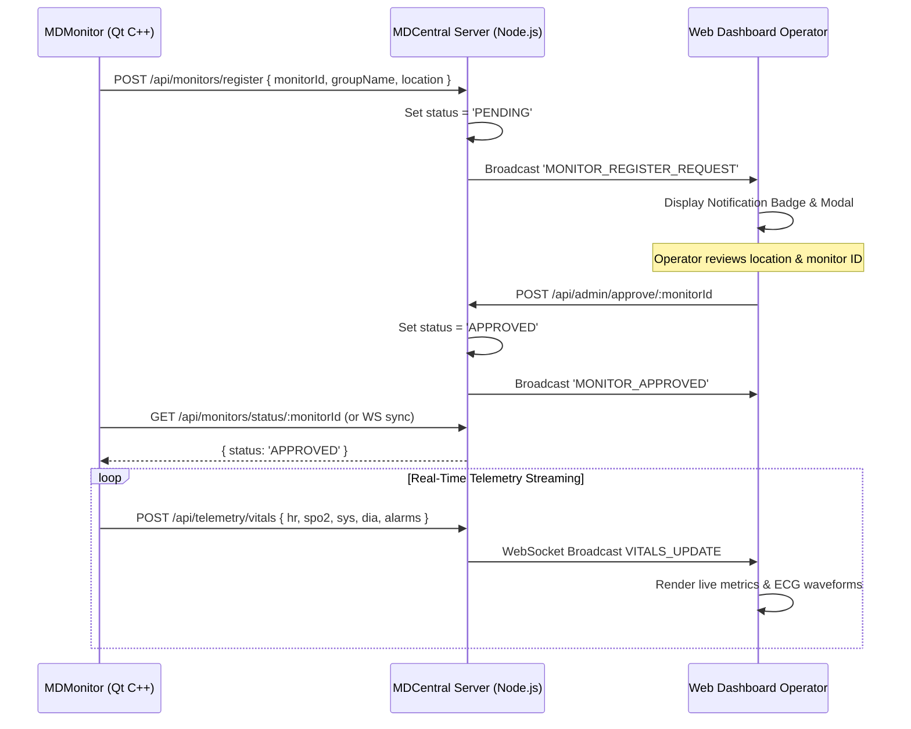

# MDCentralMonitor Architecture

## 1. System Context

```mermaid
graph TD
    subgraph Hospital Wards
        S1[MDSensors 1..N] --> M1[MDMonitor - ICU]
        S2[MDSensors 1..M] --> M2[MDMonitor - Cardiology]
    end

    subgraph MDCentral Wide-Area Web Station (:3000)
        Server[Node.js Express + WebSocket Server]
        Store[(In-Memory Partitioned Buffer: Max 1,000 Sensors)]
        ApprovalEngine[Manual Registration Approval Engine]
        WebUI[Modern Responsive Dashboard]
        HL7Engine[HL7 ORU^R01 Gateway]
    end

    M1 -- "1. POST /api/monitors/register" --> ApprovalEngine
    ApprovalEngine -- "2. Operator Clicks 'Approve'" --> Server
    M1 -- "3. POST /api/telemetry/vitals (Streaming)" --> Store
    M2 -- "3. POST /api/telemetry/vitals (Streaming)" --> Store
    
    Store --> WebUI
    Store --> HL7Engine
```

## 2. Manual Approval Flow


